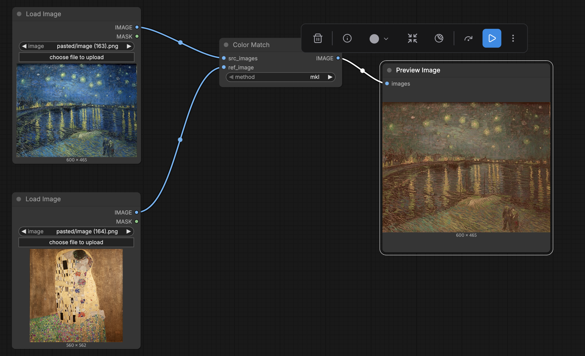

# ComfyUI-Color-Matcher



ComfyUI custom node for color matching between images. Transfers the color distribution from a reference image to source images or video frames.

## Features

- Transfer color characteristics from a reference image to source images
- Supports batch processing for video frames (multi-frame input)
- 6 color matching algorithms to choose from

## Supported Methods

| Method | Description |
|--------|-------------|
| `mkl` | Monge-Kantorovich Linearization |
| `hm` | Histogram Matching |
| `reinhard` | Reinhard et al. color transfer |
| `mvgd` | Multi-Variate Gaussian Distribution |
| `hm-mvgd-hm` | Compound: HM + MVGD + HM |
| `hm-mkl-hm` | Compound: HM + MKL + HM |

## Installation

1. Clone this repository into your `ComfyUI/custom_nodes/` directory:
   ```bash
   cd ComfyUI/custom_nodes/
   git clone https://github.com/okdalto/ComfyUI-Color-Matcher.git
   ```

2. Install dependencies:
   ```bash
   pip install -r requirements.txt
   ```

## Usage

### Inputs

- **image_ref** (IMAGE) - Reference image whose color distribution will be transferred
- **image_target** (IMAGE) - Source image or video frames to apply color matching to
- **method** (COMBO) - Color matching algorithm to use

### Output

- **IMAGE** - Color-matched result image(s)

### Workflow

1. Load a source image (or video frames) and a reference image
2. Connect them to the **Color Match** node
3. Select a matching method (default: `mkl`)
4. The output will have the color characteristics of the reference image applied to the source

## Credits

- **color-matcher** library by [hahnec](https://github.com/hahnec/color-matcher) - Core color transfer algorithms (GPL-3.0 License)
- **ComfyUI-AdvancedLivePortrait** by [PowerHouseMan](https://github.com/PowerHouseMan/ComfyUI-AdvancedLivePortrait) - Original project structure this node was built upon

## License

This project uses the [color-matcher](https://github.com/hahnec/color-matcher) library which is licensed under GPL-3.0.
